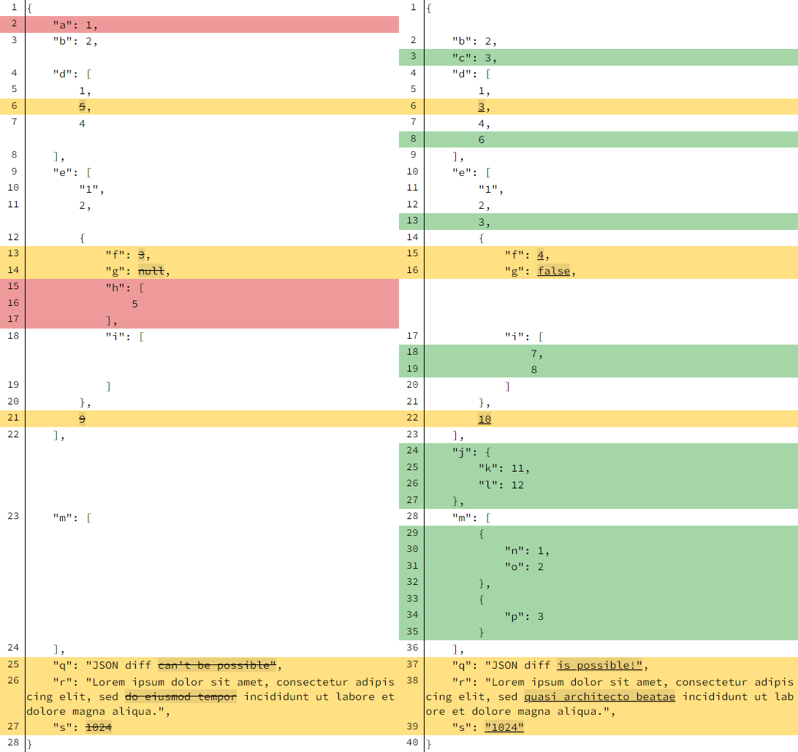
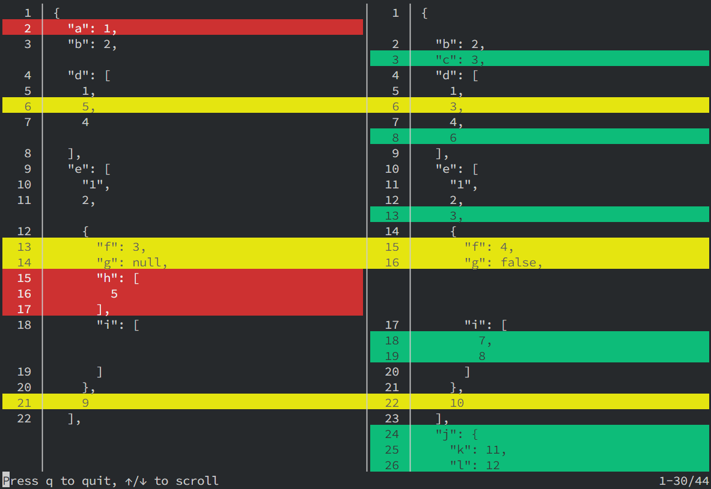

# JSON Diff Kit

[![NPM version][npm-image]][npm-url]
[![Downloads][download-badge]][npm-url]
[](https://codecov.io/gh/RexSkz/json-diff-kit)

A better JSON differ & viewer library written in TypeScript. [Try it out in the playground!](https://json-diff-kit.js.org/)

## Install

You can install `json-diff-kit` via various package managers.

```sh
# using npm
npm i json-diff-kit --save

# using yarn
yarn add json-diff-kit

# using pnpm
pnpm add json-diff-kit
```

## Quick Start

To generate the diff data:

```ts
import { Differ } from 'json-diff-kit';
// or if you are using vue, you can import the differ only
import Differ from 'json-diff-kit/dist/differ';

// the two JS objects
const before = {
  a: 1,
  b: 2,
  d: [1, 5, 4],
  e: ['1', 2, { f: 3, g: null, h: [5], i: [] }, 9],
  m: [],
  q: 'JSON diff can\'t be possible',
  r: 'Lorem ipsum dolor sit amet, consectetur adipiscing elit, sed do eiusmod tempor incididunt ut labore et dolore magna aliqua.',
  s: 1024,
};
const after = {
  b: 2,
  c: 3,
  d: [1, 3, 4, 6],
  e: ['1', 2, 3, { f: 4, g: false, i: [7, 8] }, 10],
  j: { k: 11, l: 12 },
  m: [
    { n: 1, o: 2 },
    { p: 3 },
  ],
  q: 'JSON diff is possible!',
  r: 'Lorem ipsum dolor sit amet, consectetur adipiscing elit, sed quasi architecto beatae incididunt ut labore et dolore magna aliqua.',
  s: '1024',
};

// all configs are optional
const differ = new Differ({
  detectCircular: true,    // default `true`
  maxDepth: Infinity,      // default `Infinity`
  showModifications: true, // default `true`
  arrayDiffMethod: 'lcs',  // default `"normal"`, but `"lcs"` may be more useful
});

// you may want to use `useMemo` (for React) or `computed` (for Vue)
// to avoid redundant computations
const diff = differ.diff(before, after);
console.log(diff);
```

You can use your own component to visualize the `diff` data, or use the built-in viewer:

```tsx
import { Viewer } from 'json-diff-kit';
import type { DiffResult } from 'json-diff-kit';

import 'json-diff-kit/dist/viewer.css';

interface PageProps {
  diff: [DiffResult[], DiffResult[]];
}

const Page: React.FC<PageProps> = props => {
  return (
    <Viewer
      diff={props.diff}          // required
      indent={4}                 // default `2`
      lineNumbers={true}         // default `false`
      highlightInlineDiff={true} // default `false`
      inlineDiffOptions={{
        mode: 'word',            // default `"char"`, but `"word"` may be more useful
        wordSeparator: ' ',      // default `""`, but `" "` is more useful for sentences
      }}
    />
  );
};
```

The result is here:



## Other Version of Viewer

Here is an experimental [Vue version](https://github.com/RexSkz/json-diff-kit-vue) of the `Viewer` component.

## Object Array Identity Matching

By default arrays are compared by position (`"normal"`) or by LCS content
alignment (`"lcs"`). When an array holds objects with a stable business key,
you can configure **identity selectors** so that the differ follows an
element across moves, recursively compares it in place, and only hands the
unmatched elements to the regular array strategy:

```ts
const differ = new Differ({
  arrayDiffMethod: 'lcs',
  arrayIdentitySelectors: [
    // the top level array is identified by its "id" field
    { arrayPath: '', fields: '/id' },
    // every "tags" array nested inside a root element uses a composite identity
    { arrayPath: '/*/tags', fields: ['/kind', '/code'] },
  ],
});

const [beforeLines, afterLines, diagnostics] = differ.diffWithDiagnostics(before, after);
```

### Selector paths and fields

- `arrayPath` is a [JSON Pointer](https://datatracker.ietf.org/doc/html/rfc6901)
  style path of the target array. `''` denotes the top level array, `"/users"`
  the array at property `users`, and `"/users/*/roles"` the `roles` array of
  every element of `users`. The restricted wildcard `*` matches a single
  array element position; it cannot be an object key and cannot be the final
  token (it has to point at an array). Escapes `~0`/`~1` are supported.
- `fields` are JSON Pointer tokens relative to the element object, e.g.
  `"/id"` or `["/kind", "/meta/name"]` for a composite identity. A selector
  only **reads existing fields** (or combinations of them); it never executes
  arbitrary code. Selectors with overlapping target paths are rejected when
  the `Differ` is constructed.

### Normalized identity values

Each declared component is normalized into a canonical key, and two elements
match only when their composite keys are byte-for-byte identical:

- a **missing** field, an explicit **`null`**, and an existing scalar are all
  distinct;
- strings and numbers never compare equal (`"1"` ≠ `1`), and booleans are
  distinct as well;
- `-0` and `0` are treated as the same identity;
- `NaN`, `±Infinity`, objects, arrays, functions and other non-JSON values are
  **illegal** identity components: the element gets an
  `invalid-identity-value` diagnostic and is routed to the fallback strategy;
- composite identities are independent of the field declaration order (the
  components are sorted by field path).

### Duplicate identities and diagnostics

The differ never performs "last one wins" overwriting. If the same identity
key occurs more than once on either side of an array, every involved element
is excluded from identity matching and rendered through the configured
`arrayDiffMethod`. A `duplicate-identity` diagnostic records the key, the side
and all involved indices. Set `onDuplicate: 'throw'` on a selector to abort
the whole diff instead:

```ts
new Differ({
  arrayIdentitySelectors: [{ arrayPath: '', fields: '/id', onDuplicate: 'throw' }],
});
```

`Differ#diff` keeps its historical `[before, after]` return type; use
`Differ#diffWithDiagnostics` for the typed `[before, after, diagnostics]`
tuple.

### Output model

Every line belonging to an identity-matched element carries an `identity`
object:

```ts
interface DiffResultIdentity {
  entityId: number;                 // stable within one diff run
  basis: 'identity';
  oldIndex: number;                 // index in the old array
  newIndex: number;                 // index in the new array
  moved: boolean;                   // position changed
  modified: boolean;                // recursive content changed
  matchedBy: { arrayPath: string; fields: string[]; identityKey: string };
}
```

A moved-then-modified element is therefore rendered as **one linked entity**
(moved `&&` modified) instead of a remove plus an add. The `Viewer` consumes
this metadata directly: pure moves are tinted with a `line-move` class and a
`⇄` gutter badge, moved-and-modified rows use `line-move-modified` with a
`⇄*` badge, inline diffs still highlight the internal change, and pure moves
participate in the unchanged-lines folding context instead of being hidden.
Custom renderers can use the exported `getLineIdentityView` /
`getLineIdentityClass` helpers.

### Complexity and compatibility

- Identity extraction is linear in the element field count. Pairing is
  `O(n + m)` per array; the paired elements are emitted in original (before)
  index order so the left column stays strictly line-number monotonic, and
  unmatched runs go through the selected strategy (`"normal"` is `O(LEN)`,
  `"lcs"` is `O(LEN²)`).
- Identity matching only activates for the configured arrays; elements that
  are not objects, lack a usable identity, are ambiguous, or are illegal fall
  back to `arrayDiffMethod`. Inside fallback runs a concrete numeric array
  index in a selector path refers to the compacted fallback slice; wildcard
  selectors are recommended for nested arrays.
- When no `arrayIdentitySelectors` option is supplied (or it is empty), the
  dispatcher is not installed at all and the output is byte-for-byte identical
  to previous versions; no new fields appear on `DiffResult`, and the
  `compare-key` / `unorder-*` modes keep their existing behavior.

## More Complex Usages

Please check the [playground page](https://json-diff-kit.js.org/), where you can adjust nearly all parameters and see the result.

## CLI Tool

You can use the CLI tool to generate the diff data from two JSON files. Please install the package `terminal-kit` before using it.

```bash
pnpm add terminal-kit # or make sure it's already installed in your project

# Compare two JSON files, output the diff data to the terminal.
# You can navigate it using keyboard like `less`.
jsondiff run path/to/before.json path/to/after.json

# Output the diff data to a file.
# Notice there will be no side-by-side view since it's not a TTY.
jsondiff run path/to/before.json path/to/after.json -o path/to/result.diff

# Use a custom configuration file and output the diff data to a file.
jsondiff run path/to/before.json path/to/after.json -c path/to/config.json -o path/to/result.diff

# Print the help message.
jsondiff --help
jsondiff run --help
```



## Algorithm Details

Please refer to the article [JSON Diff Kit: A Combination of Several Simple Algorithms](https://blog.rexskz.info/json-diff-kit-a-combination-of-several-simple-algorithms.html?cc_lang=en).

## Features & Roadmap

- [x] Provide a `Differ` class and a `Viewer` component
- [x] Merge "remove & add" at the same place as a modification
- [x] Support inline diffing by word instead of by character
- [x] Generate code directly in the demo page (covered by playground)
- [x] Optimise `Viewer` performance by adding virtual scrolling
- [x] Add CLI tool
- [x] Provide a Vue version of `Viewer`
- [x] Match object array elements by declarative identity selectors (moves vs. content changes)
- [ ] Improve unit tests

## License

MIT

[npm-url]: https://npmjs.org/package/json-diff-kit
[npm-image]: https://img.shields.io/npm/v/json-diff-kit.svg

[download-badge]: https://img.shields.io/npm/dm/json-diff-kit.svg
